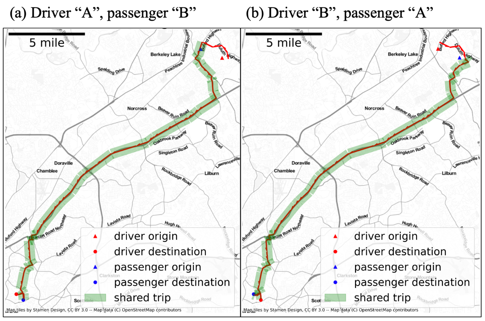
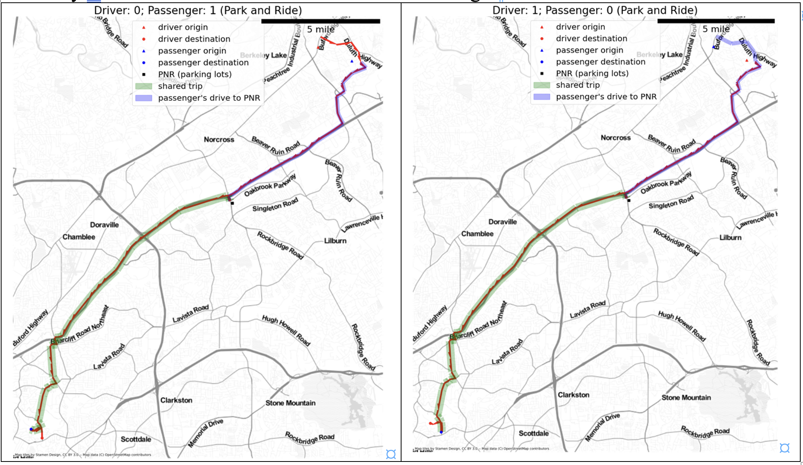
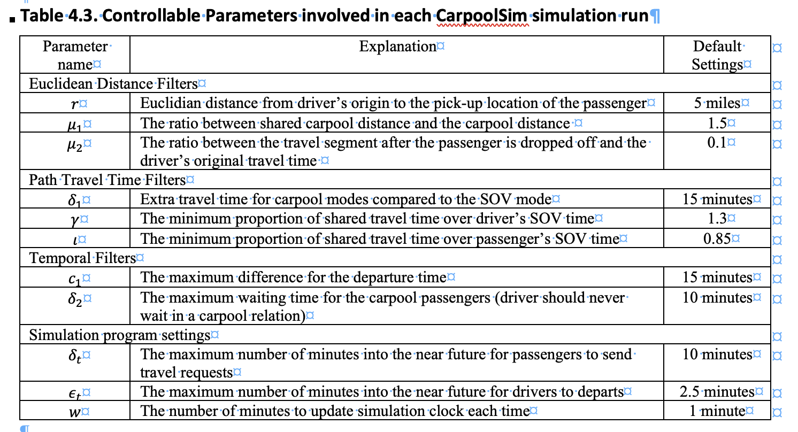

# CarpoolSim: A simulation framework to find carpool trips given Single Occupancy Trips

One can refer to the [GitHub repository](https://github.com/thefriedbee/CarpoolSim) for source code and more information about this package.

## Two different kinds of carpooling

Between two travelers, there are two possible schemes of direct carpool



Between two travelers, given a middle point to meet, there are two possible schemes of carpooling (i.e., Park-and-Ride Carpool)



## The required data classes for modeling *traffic network* is listed as follows

Three datasets or shapefiles are necessary to represent a traffic network:
- TrafficNetworkNode
- TrafficNetworkLink
- TrafficAnalysisZone
  
```mermaid
classDiagram
    TrafficNetworkNode: +int nid
    TrafficNetworkNode: +float lon
    TrafficNetworkNode: +float lat
    TrafficNetworkNode: +float x
    TrafficNetworkNode: +float y
    TrafficNetworkNode: +Point geometry
    
    TrafficNetworkLink: +int a
    TrafficNetworkLink: +int b
    TrafficNetworkLink: +str a_b
    TrafficNetworkLink: +str name
    TrafficNetworkLink: +float distance
    TrafficNetworkLink: +float factype
    TrafficNetworkLink: +float speed_limit
    TrafficNetworkLink: +LineString geometry
    
    TrafficAnalysisZone: +int taz_id
    TrafficAnalysisZone: +str group_id
    TrafficAnalysisZone: +Polygon geometry
```

Another dataset is necessary to define the travel demands by providing the following minimal required set of information.

```mermaid
classDiagram
    TripDemand: +int trip_id
    TripDemand: +float orig_lon
    TripDemand: +float orig_lat
    TripDemand: +float dest_lon
    TripDemand: +float dest_lat
    TripDemand: +float new_min
    TripDemand: +Point geometry
```

The geometry field of "TripDemand" corresponds to the origin of the trip.  Finally, some parking lots can be identified
and represented to consider park and ride carpool.

```mermaid
classDiagram
    ParkAndRideStation: +int station_id
    ParkAndRideStation: +str name
    ParkAndRideStation: +float lon
    ParkAndRideStation: +float lat
    ParkAndRideStation: +int capacity
    ParkAndRideStation: +Point geometry
```

By default, all geometry fields are using "EPSG:4326" (WGS84) projection as inputs.

## The structure of the project is shown as follows.

```
.
├── carpoolsim  # contains Python code (called by Jupyter Notebooks)
│   ├── basic_settings.py  # IMPORTANT: set up basic information of the project (modify based on your need)
│   ├── carpool  # the core pipeline of running the carpool "simulation"
│   │   ├── __init__.py
│   │   ├── trip_cluster.py
│   │   └── trip_cluster_with_time.py
│   ├── carpool_solver   # the core algorithm (i.e., bipartite) to solve the problem
│   │   ├── __init__.py
│   │   └── bipartite_solver.py
│   ├── database  # code to prepare and interact with the database (e.g., SQLite)
│   │   ├── __init__.py
│   │   ├── prepare_database.py
│   │   └── query_database.py
│   ├── dataclass  # an interface of all data objects to standardize input data
│   │   ├── __init__.py
│   │   ├── parking_lots.py
│   │   ├── traffic_network.py
│   │   └── travel_demands.py
│   ├── network_prepare.py
│   ├── prepare_input.py
│   └── visualization  # visualization tool for plotting results
│       ├── __init__.py
│       ├── carpool_viz.py
│       └── carpool_viz_seq.py
├── data_inputs  # all input data (example of the notebooks)
│   ├── ABM2020 203K
│   │   ├── 2020 links  # traffic network link file
│   │   ├── 2020 nodes with latlon  # traffic network node file
│   │   └── taz  # traffic analysis zone
│   ├── Park_and_Ride_locations  # a shapefile/csv of parking lots
│   ├── gt_survey  # trip demands (survey data in this case)
│   └── cleaned  # cleaned dataset (for all intermediate results before runnig simulation)
├── data_outputs  # store the outputs (and intermediate results)
└── notebooks # all Jupyter notebooks to run the program
```
You can move those files to "data_inputs" folder. 
The files within the "data_inputs" folder are just an example of our own project.
You can set up any folder structure, but remember to reset the paths parameters in *basic_settings.py*.

Require inputs 
1. Three network files:
   1. traffic networks shapefile: a shapefile of traffic links 
   2. traffic nodes shapefile: a shapefile of traffic nodes 
   3. taz: traffic analysis zone that splits a metropolitan region to many small parts
2. One file for PNR stations of Park-and-ride mode:
   1. Park_and_Ride_locations: Parking lots that can be used for Park and Ride trip
3. One file for traffic demand:
   1. gt_survey: a survey of **trip demands** providing origin, destination, depart time, etc.

## Use notebooks to run the analysis pipeline
Four Jupyter notebooks are provided to run the package. Users are obligated to modify those notebooks to align
with their own analysis purpose. The code talks by itself in those notebooks.
- step0_prepare_data_inputs.ipynb
- step1_prepare_path_retention_database.ipynb
- step2_prepare_traffic_demands.ipynb
- step3_run_carpoolsim.ipynb

## Configure the quality of carpools
The tool provides a rich set of parameters as a filtering "safe net" of the tool.

```python
kwargs = {
    # use bipartite method. If not, may try to use linear optimization
    'rt_bipartite': True,
    # setup print options
    'verbose': False, 'print_mat': False, 'plot_all': True,
    # coordinate filters
    'mu1': 1.5, 'mu2': 0.1, 'dst_max': 5*5280,
    # reroute filters
    'delta': 10, 'gamma': 1.3, 'ita': 0.9, 'ita_pnr': 0.5,  # reroute filters
    # Delta1: control passenger/driver's departure time difference
    # Delta2: control driver's maximum waiting time
    'Delta1': 15, 'Delta2': 10, 'Gamma': 0.2,
    # carpool mode 
    #   0: direct carpool only;
    #   1: pnr carpool only; 
    #   2: both at the same time
    'mode':0
}
```

A slightly more detailed explaination is given as follows:



## How to cite?
If you use the tool, it is strongly recommended to cite the tool using the following link:

```
@inproceedings{
   title={Evaluating Potential SOC Commuter Home-to-Work Carpool Using a Scalable and Practical Simulation Framework}
   author={Liu, Diyi and Fan, Huiying and Guin, Angshuman and Guensler, Randall}
   year={2024}
   booktitle={Journal of Transport Geography}
}
```

Or,
```
@inproceedings{
   title={CarpoolSim: A Computational Framework Measuring Carpool Potentials Given Travel Demands}
   author={Liu, Diyi and Fan, Huiying and Guin, Angshuman and Guensler, Randall}
   year={2024}
   booktitle={SoftwareX}
}
```


Or,
```
@article{liu2022evaluating,
  title={Evaluating the Sustainability Impacts of Intelligent Carpooling Systems for SOV Commuters in the Atlanta Region},
  author={Liu, Diyi and Guin, Angshuman},
  year={2022}
}
```
